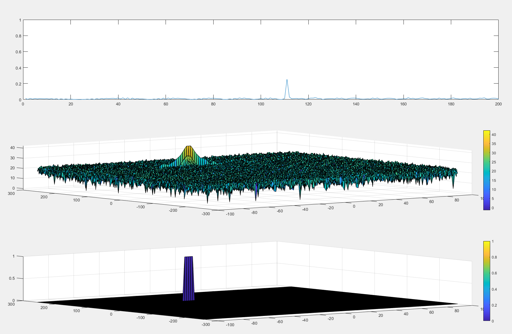

# Radar Target Generation & Detection Project

## FMCW Waveform Design

Added a separate script [`signals.m`](signals.m) to factor signal generation out. Vectors for storing intermediate distances and time delays are thus unnecessary.

Calcualted slope: `2.045e13`

## Simulation Loop

Generated the simulation loop using the refactored `signals` function. The range of the target is detected at ~111 m. See the top chart on the diagram 1 below.


## Range FFT (1st FFT)

See diagram 2 below. The second illustration plots the signal after Range FFT. The signal peaks at 110 m showing correct detection

## 2D CFAR

See diagram 3 below depicting the results.
We implement [CA-CFAR](https://en.wikipedia.org/wiki/Constant_false_alarm_rate) by:
1. Creating the 2D FFT based on ranged FFT.
2. Initialize the output grid of filtered signal to 0.
3. Parameterizing the algorithm with training, guarding cells in 2 dimensions and an offset as follows:

```matlab
% *%TODO* :
%Select the number of training Cells in both the dimensions.
Tcr = 8;
Tcd = 2;

% *%TODO* :
%Select the number of Guard Cells in both dimensions around the Cell under 
%test (CUT) for accurate estimation
Gcr = 4;
Gcd = 1;

% *%TODO* :
% offset the threshold by SNR value in dB
offset = 9;
```

Here the ratio of row to column training / guarding cells was picked based on the rows / cols ratio of 4 (`Nr/2 = 512`, `Nd = 128`)

3. The double-loop is used to slide the guarding and training cells mounted around the CUT (cell under test) over the entire grid created in 1. Sliding is done so that **all** of the cells around FFT are found in the grid, meaning that not all of the cells will have a chance to be a CUT. For those cells we set the output signal to 0. This is a noop since we have already initialized the output array to 0.
4. Compute the threshold value, averaging over training cells and setting the cell corresponding to CUT in the output to 1 if CUT value is greather than the threshold.

